---
title: "Generating images with AI - a stable diffusion guide 0.2"
author: "Glenn De Backer"
subject: "Markdown"
keywords: [Markdown, Example]
lang: "en"
toc: true
toc-own-page: true
titlepage: true,
titlepage-rule-color: "360049"
titlepage-background: "backgrounds/background1.pdf"
header-includes:
- |
  ```{=latex}
  \usepackage{awesomebox}
  ```
pandoc-latex-environment:
  noteblock: [note]
  tipblock: [tip]
  warningblock: [warning]
  cautionblock: [caution]
  importantblock: [important]
...

# Stable diffusion

## What is stable diffusion? 

[TODO]

## Installations

To use stable diffusion models we will need to download a user interface to relatively easy to interact with stable diffusion models. This guide will handle the installation of the popular UI Stable Diffusion WebUI

We will need to install 3 things

* *Python* - which is a interpreter for the program language Python that the UI is written in
* *Git* - which is a program that handles automatic tasks regarding sourcecode, models,... 
* *Stable Diffusion Webui* - the User interface needed to interact with the AI

#### Requirements

* Intel or AMD processor
* 16Gb RAM
* Nvidia Geforce card 10xx or higher

::: tip
More than GPU speed of your videocard, Video Ram is also important. Especially if you want to generate higher resolution images. This can be mitigated by generating in lower resolution and use upscaling
:::


::: warning
This guide goes out from a Windows PC with a Nvidia GPU. Mac should be supported if you use a M1 or higher processor, see guide [https://github.com/AUTOMATIC1111/stable-diffusion-webui/wiki/Installation-on-Apple-Silicon](https://github.com/AUTOMATIC1111/stable-diffusion-webui/wiki/Installation-on-Apple-Silicon) Your mileage may vary. 
:::

\newpage

#### Installing Python

The first thing we need to is install the Python interpreter. Go to [https://www.python.org/](https://www.python.org/) and look for version **3.10.6**. 

Click *Download Windows Installer (64bit)* and execute the setup after downloading it. 

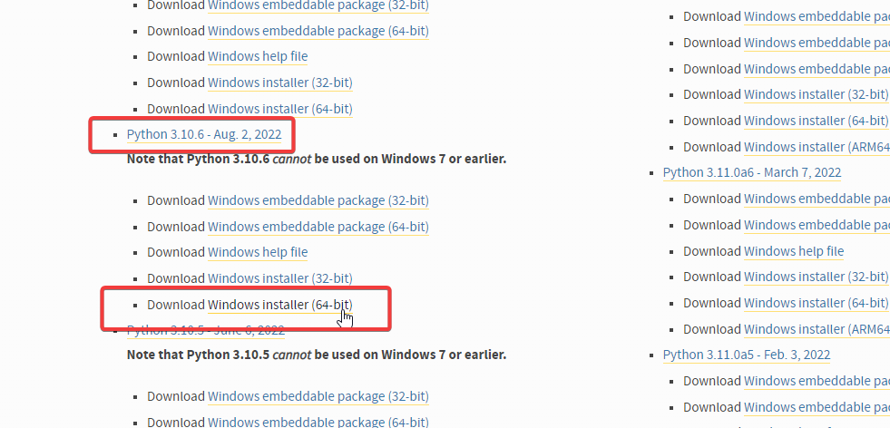

::: warning
While you could use a newer version of python, it could happen that the installation won't work as some packages are not updated for the newer version. This document goes out from the version mentioned above.
:::

\pagebreak

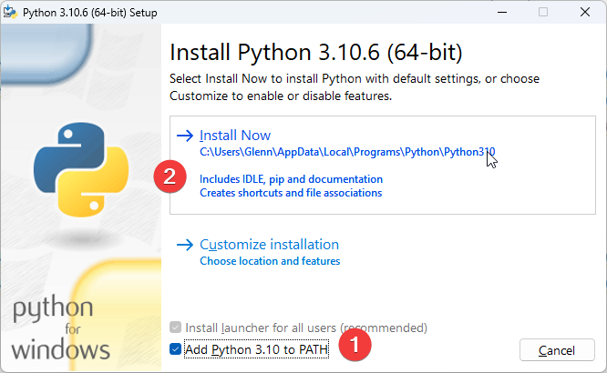{width=70%}

This is the first screen of the Python installer

1. Be sure that the **Add Python 3.x.x to Path** is selected!!! 

2. Click **Install now**

Finish the installation.

\newpage

### Installing Git

Go to [https://git-scm.com/download/win](https://git-scm.com/download/win) and click **64-bit Git for Windows Setup.**

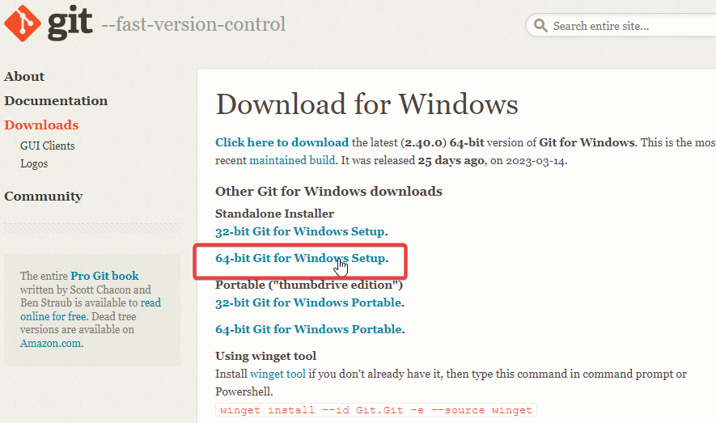{width=60%}

Start the setup and click the Next button

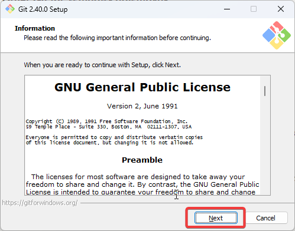{width=60%}

Click Next

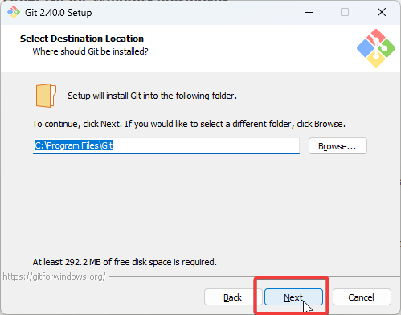{width=60%}

Optionally you can disable "Window Explorer integration"

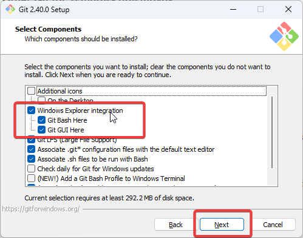{width=60%}

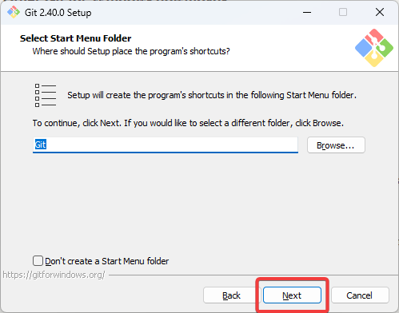{width=60%}

On each dialog you can click **Next** and use the default values until you get at the last dialog where you click **Finish**

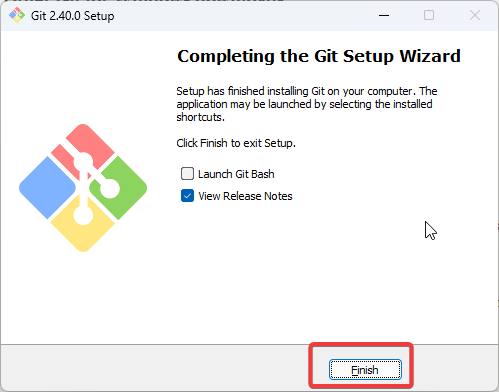{width=60%}

\newpage

### Installing Stable diffusion webui

At this moment the UI that has very active development including extension is Stable Diffusion WebUI. Go to the [https://github.com/AUTOMATIC1111/stable-diffusion-webui](https://github.com/AUTOMATIC1111/stable-diffusion-webui) and download a zip of the repository

1. Click on the **Code** dropdown
2. And click **Download ZIP**

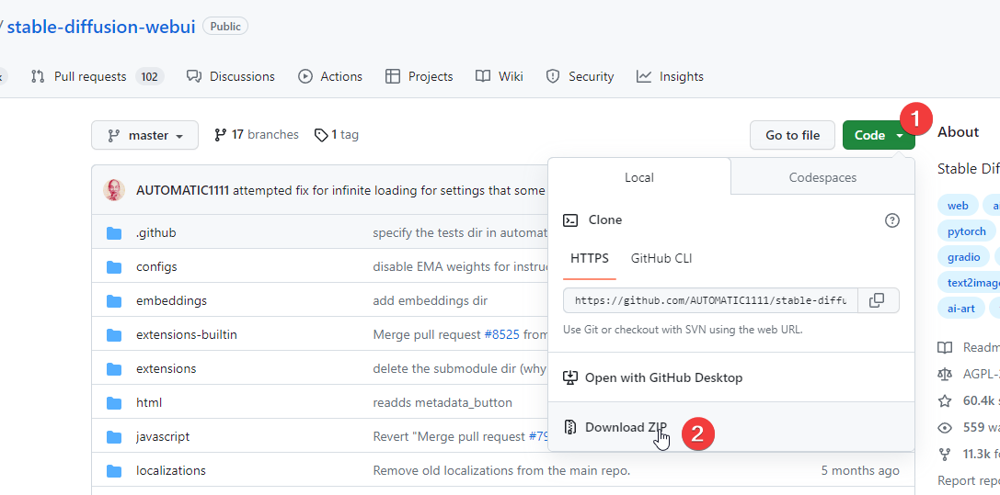{width=80%}

Click on **webui-user** (Batch) to start the rest of the installation

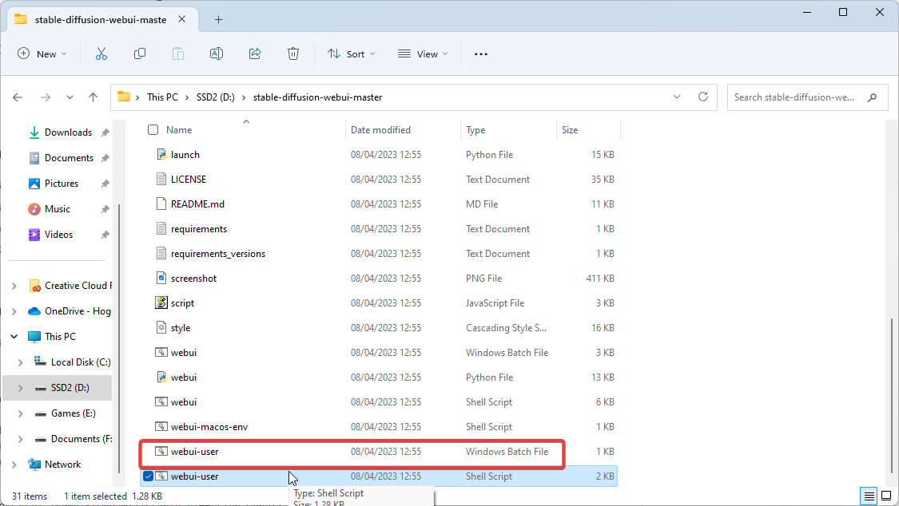{width=80%}

As python scripts are not signed you will get a message that the script can't be run. You can ignore the doom and gloom message. 

{width=50%}

Click on **More info** and **Run anyway**

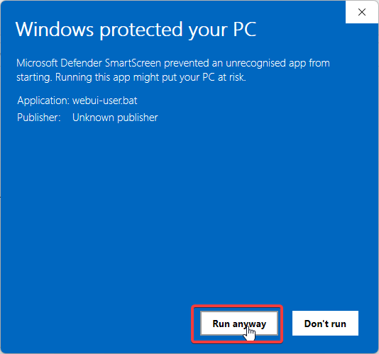{width=50%}

\newpage
The following will take a lot of time, so take a cup of tea and fill in a crosswords puzzle. This happens the only first time you startup the program. 

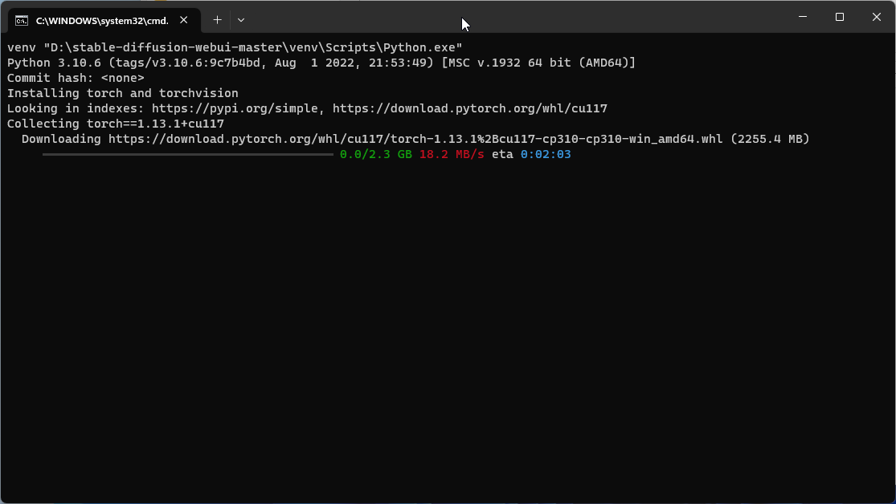{width=70%}

::: tip
Sometimes you will get an error. I think this is related to Python sometimes not being able to keep up. The most easy fix in those cases is, close the window and relaunch the app as by clicking on **web-user.bat** as in Step 2
:::

When a problem occurs it seems to pickup where it's left what in most cases seem to mitigate any problems

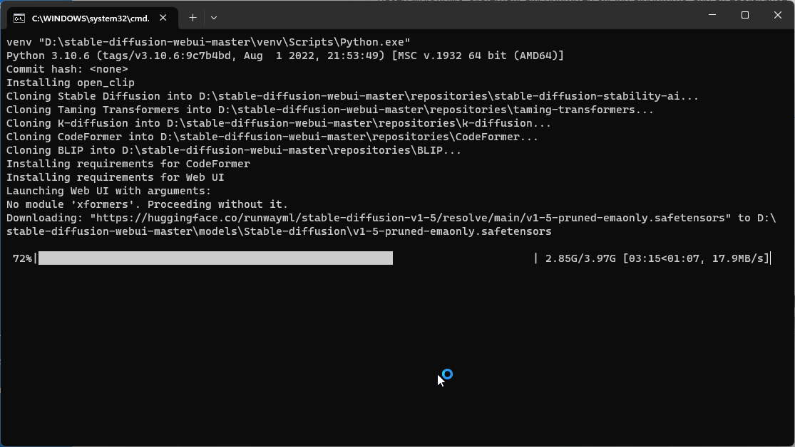{width=70%}

When you the message **Running on Local URL: 127.0.0.1:7860** the UI has been started

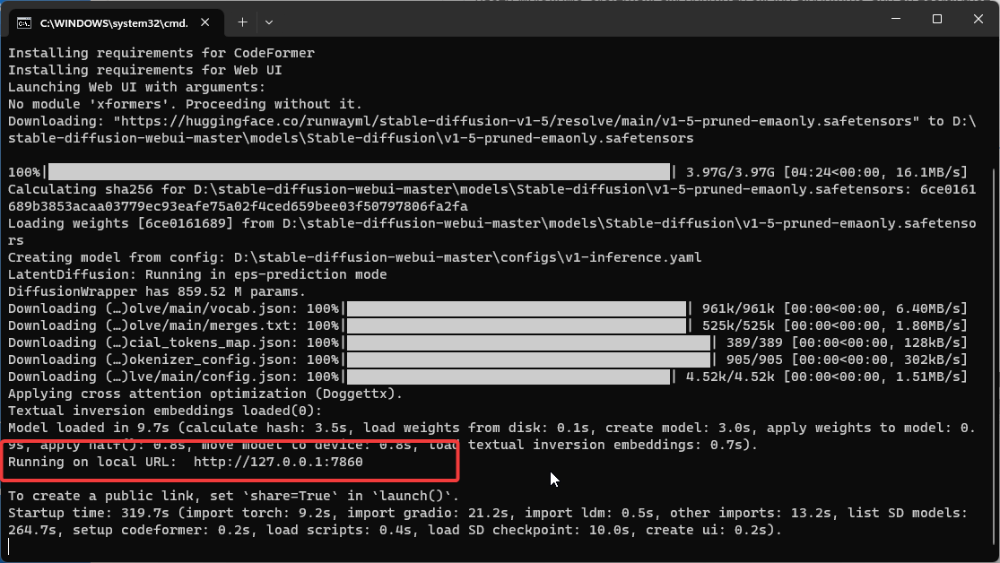{width=70%}


\newpage

### Working with the Stable Diffusion UI

### Accessing the UI

You can access the GUI by opening your webbrowser and type [https://127.0.0.1:](http://127.0.0.1:7860/) 

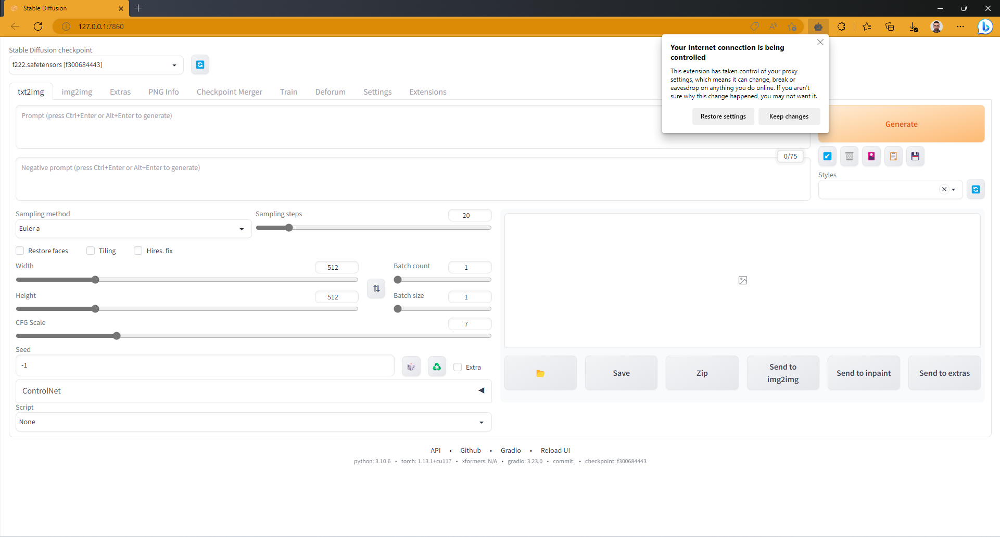{width=80%}

Alternatively you can *control + right click* on the url in the console to open it automatically

{width=80%}

### Generating your first image

1. Enter the description of what the AI needs to generate. **Be as specific as possible!**
2. Click **Generate**
3. The generated image - this will take some time - will be displayed here

&nbsp;
&nbsp;

{width=100%}

\newpage

### Writing prompts 

### Be specific

A good prompt is detailed and specific. Some (optional) examples: 

* Subject: cat, woman, child, …
* Verb: what is the subject doing, standing, dancing, …
* Medium:  sketch, photography, oil painting, …
* Artist: Picasso, Da Vinci, Van Gogh, …
* Quality: High definition, 4K, 8K,....

For more information I highly recommend the OpenART Prompt book available on [https://openart.ai/promptbook](https://openart.ai/promptbook)

### Be negative!

You will often get things you don’t want to have in your image. You can mitigate this by adding negative keywords.

For example we generate some pictures of men. 

{width=50%}

{width=100%}

Ok nice, but one thing that you will notice that it generates a lot of pictures of men with beards. And maybe we have a case where we don't want that. 

So you fix that by filling in **beard** as a keyword in the negative prompt input and generate again. 

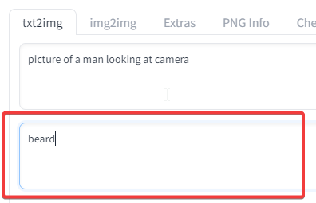{width=50%}

As you can see the results does not include men with beards. 

{width=100%}

So why would you not use "Photo of a man without a beard"? Because the AI is dumb and sometimes it does not make the connection with *without* and *beard* what could even get results with more beards!

::: tip
The rule is **What you do not want to see, put in the negative prompt**. This could also be misformed hands, blurry images, drawing,...
:::

### Add some weight

### Some tips

* Start simple
* Work iterative, sometimes adding some words can make a result better
* I try to generate in batches of 5 and check if it's more or less what I want than refine. 

\newpage

### The internet has been lying...

You will see a lot of examples on the internet that seems to be perfect. But in most cases, they have been edited in Photoshop or there have been a lot of generations. It's even possible to (re)generate only a part of an image by using a technique called Inpainting. 

Fortunately generating multiple images is something that SD UI makes easy.

### Generating multiple images

Look for the **Batch count** slider (1) and change the value to the amount of images the AI needs to generate which will be become visible in the results (2) section

For example setting the value to 5 will generate 5 images, 10 will generate 10 images,.... Easy!

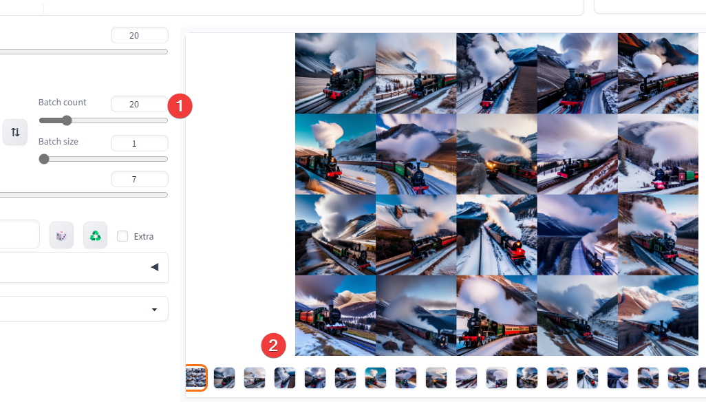{width=100%}

::: tip
You can also change the number of images each batch will generate for example *Batch count* 5 and *Batch size* 4, will give 5 x 4 or 20 images
:::

### Use different parameters

You have the prompt *scene of an apple sitting on a wooden table*. What if you quickly want to generate a scene where the fruit is an apple, a watermelon or a orange? 

You could use different prompts or more easy to the following

{width=100%}

1. Change the script to **X/Y/Z Plot**
2. Change X type to **Prompt SR**
3. Change X values to **an apple**, **a watermelon**, **a orange**
4. Enable **Include Sub Images** - so you can save the images individually

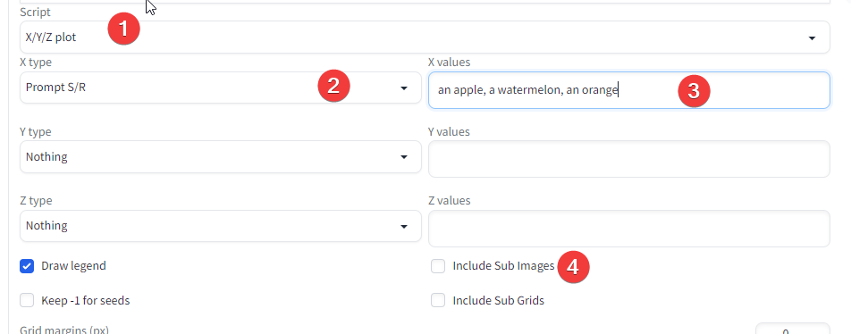{width=90%}

So what happens here when you press **generate** ?

1. It searches for *an apple* in your prompt and generate that prompt. 
2. It searches for *an apple* in your prompt, replaces it with **a watermelon** and generate that prompt. 
3. It searches for *an apple* in your prompt, replaces it with **a orange** and generate that prompt. 
4. It displays the result in columns

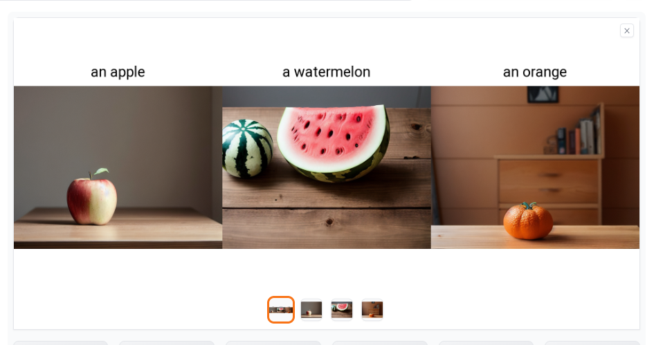{width=70%}
